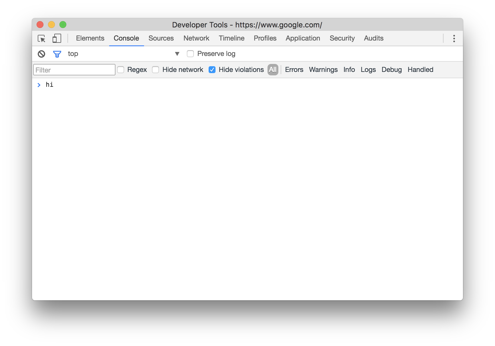

## Manipulating Class with JS

Use Javascript to make a webpage more interactive. So far you have been focusing on styling webpages with CSS (aesthetics, visibility, etc). Javascript is a language that allows us to compute and perform actions within a website. Most interactive libraries on the web are based in javascript.

Utilizing Chrome’s javascript console is very important in tracking the behaviour, and debugging your code.  

  

~~~
console.log('hi);
~~~

We can do things in JS than cannot be done in HTML in CSS, such as arithmatic, storing and comparing values, executing functions, and monitoring events in the DOM (Document Object Model).

Today we are going to skip the [basics](http://jsforcats.com/) and get straight to monitoring and reacting to events in the DOM. 
 
  
### The DOM

> 
With the object model, JavaScript gets all the power it needs to create dynamic HTML:  

>
- JavaScript can change all the HTML elements in the page
- JavaScript can change all the HTML attributes in the page
- JavaScript can change all the CSS styles in the page
- JavaScript can remove existing HTML elements and attributes
- JavaScript can add new HTML elements and attributes
- JavaScript can react to all existing HTML events in the page
- JavaScript can create new HTML events in the page

### Document Object Methods & Properties  

When a HTML document is loaded into a web browser, it becomes a document object. This object comes along with various properties, and functions (called methods with the goal of manipulating elements within the document object.)

Today we will be focusing on one of the most frequently used document methods:

| Method | Description |
|--------|-------------|
| document.querySelector() | Returns the first element that matches a specified CSS selector(s) in the document |

[Full List of Methods & Properties](https://www.w3schools.com/jsref/dom_obj_document.asp)  

### Element Oject Methods & Properties  

Just like the Document Object itself, elements within the Document Object come with some handy methods and properties for use in JS:

| Method | Description |
|--------|-------------|
| element.addEventListener() | Attaches an event handler to the specified element |
| element.closest() | Returns the closest ancestor of the current element with given selector |
| element.classList.add() | Add a class to specified element |
| element.classList.remove() | remove a class from specified element |
| element.classList.toggle() | toggle a class on specified element |

[Full List of Methods & Properties](https://www.w3schools.com/jsref/dom_obj_all.asp) 

### Event Listeners

Event listeners allow us to run a chunk of code, dependent on the behaviour of elements within the Document. We can ‘listen’ to any element for clicks, hovers, scrolls, keyboard presses, media events (play, pause, etc) and much more

Today we will focus on `click`

For example, the syntax for attaching an event listener to an object is as follows:

~~~
element.addEventLister('event', listener)
~~~

Often, that listener will take the form of an anonymous function. We implement that syntax like this:

~~~
var element = document.querySelector('#my-element');
element.addEventListener('click', function() {
	// some code here
});
~~~

[Full List of Events](https://developer.mozilla.org/en-US/docs/Web/Events)

### Manipulating CSS Via Javascript  

We can change the classes assigned an element like so:

~~~
element.classList.toggle('is-red');
~~~

### Refereneces  

[Document Object Methods & Properties](https://www.w3schools.com/jsref/dom_obj_document.asp)  
[Element Oject Methods & Properties](https://www.w3schools.com/jsref/dom_obj_all.asp)  
[List of Events](https://developer.mozilla.org/en-US/docs/Web/Events)  
[CSS Transitions](https://developer.mozilla.org/en-US/docs/Web/CSS/transition)  
[CSS Animation](https://developer.mozilla.org/en-US/docs/Web/CSS/CSS_Animations/Using_CSS_animations)

### Further Reading 

[JS for Cats](http://jsforcats.com/)  
[Eloquent JS](http://eloquentjavascript.net/00_intro.html)  
[Eloquent JS: The Document Object Model](http://eloquentjavascript.net/13_dom.html)  