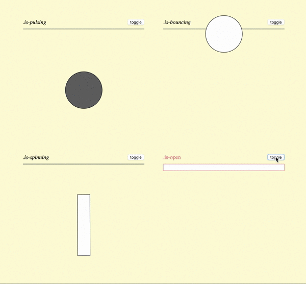

## Assignment

Based on the design patterns we established today, make three more ‘interaction library’ entries:

1. **.is-pulsing**  
2. **.is-spinning**  
3. **.is-open**  

  

Here are some starter styles you can use in your css to draw a rectangle (instead of a circle for **.is-spinning**), and a ‘drawer’ (for **.is-open**)

~~~
.rect {
    width: 10%;
    height: 50%;
    background-color: white;
    border: 1px solid lightcoral;
}
~~~
~~~
.drawer {
    width: 100%;
    height: 5%;
    align-self: start;
    background-color: white;
    border: 1px solid lightcoral;
    border-top: 0;
    transition: height .25s;
}
~~~

## Refereneces  

[CSS Transitions](https://developer.mozilla.org/en-US/docs/Web/CSS/transition)  
[CSS Animation](https://developer.mozilla.org/en-US/docs/Web/CSS/CSS_Animations/Using_CSS_animations)  
[CSS Rotate](https://developer.mozilla.org/en-US/docs/Web/CSS/transform-function/rotate)